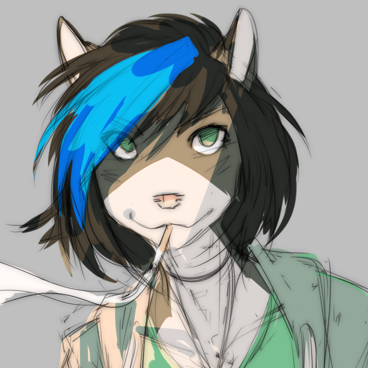

<a href="https://theomega.zone/"></img></a>

<h2 align="center">Omega</h2>

<i>Awaiting your command...</i>

Omega is a flexible Discord bot written in TypeScript, and using [Harmony](https://github.com/harmonyland/harmony/).

## Getting Started
### Dependencies
* `deno` (runtime)
* `semver` (versioning)

### Build and Run
1. Clone this repository
2. Use `build.sh` to generate `index.ts` from the `VERSION` file and git hash
3. Run `run.sh` to start Omega

### Commiting
* Use `version-up.sh` to bump the version number prior to commiting, options are `major`, `minor`, and `patch`

## Author
[CompaqDisc](https://www.compaqdisc.com/)